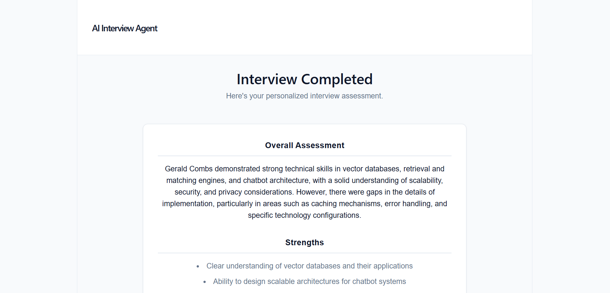
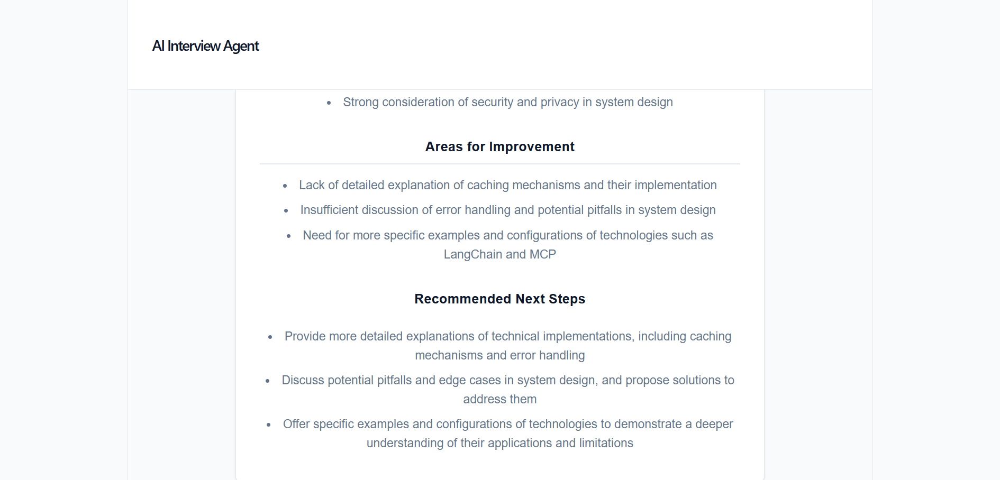

# AI Interview Agent

An AI-powered technical interview platform that conducts adaptive interviews, evaluates candidate responses, and generates personalized feedback using Large Language Models.

## 📌 Overview

AI Interview Agent is an intelligent interview system designed to simulate a technical interview experience.

The system dynamically generates interview questions based on the interview context, evaluates candidate answers, continues the interview based on the conversation, and produces a final assessment containing strengths, areas for improvement, and recommended next steps.

The project was developed as part of a Cohort AI project.

---

## ✨ Features

- 🤖 AI-generated technical interview questions
- 👤 Candidate and session management
- 💬 Interactive interview interface
- 🧠 Dynamic answer evaluation
- 📊 Technical scoring and evaluation
- 🔄 Multi-question interview flow
- 📝 Personalized final feedback
- 💪 Strength identification
- ⚠️ Knowledge gap identification
- 🚀 Recommended improvement steps
- 🔐 Environment variable support for API credentials
- ⚡ React-based frontend with FastAPI backend

## 📊 Final Assessment
## 📸 Application Screenshots

### Start Interview


### AI Technical Interview


### Final Assessment — Overview



### Final Assessment — Recommendations


---

## 🏗️ System Architecture

```text
                   ┌─────────────────────┐
                   │      Candidate      │
                   └──────────┬──────────┘
                              │
                              ▼
                   ┌─────────────────────┐
                   │   React Frontend    │
                   │       (Vite)        │
                   └──────────┬──────────┘
                              │
                       REST API Request
                              │
                              ▼
                   ┌─────────────────────┐
                   │   FastAPI Backend   │
                   └──────────┬──────────┘
                              │
                              ▼
                   ┌─────────────────────┐
                   │ Interview           │
                   │ Orchestrator        │
                   └──────────┬──────────┘
                              │
              ┌───────────────┼───────────────┐
              ▼               ▼               ▼
       Interview Planner  Evaluator    Feedback Generator
              │               │               │
              └───────────────┼───────────────┘
                              │
                              ▼
                   ┌─────────────────────┐
                   │    Groq / LLM       │
                   └─────────────────────┘
                              │
                              ▼
                   ┌─────────────────────┐
                   │ Final Assessment    │
                   │ Strengths / Gaps    │
                   │ Next Steps          │
                   └─────────────────────┘